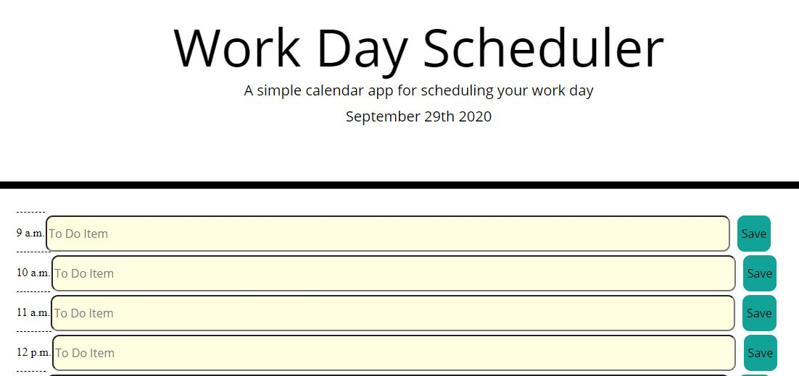

# Work Day Scheduler

### Deployed Application 

[Workd Day Scheduler](https://areye022.github.io/workdayscheduler/)

### Description 
This application allows users to generate a daily work schedule.

When the workscheduler is utilized, users will be able to save tasks and events into the selected timeblocks. Each time block will have a color of grey, gree, or yellow. Grey will signify that the timeblock has already passed. Green signifies the current timeblock we are in, and yellow signifies future timeblocks.

### Features
* Saves all features to local storage so that events persist throughout day. 
* Utilizes Bootstrap features such as jumbotron, containers, etc.   
* Utilizes moment() to keep track of date and time. 

